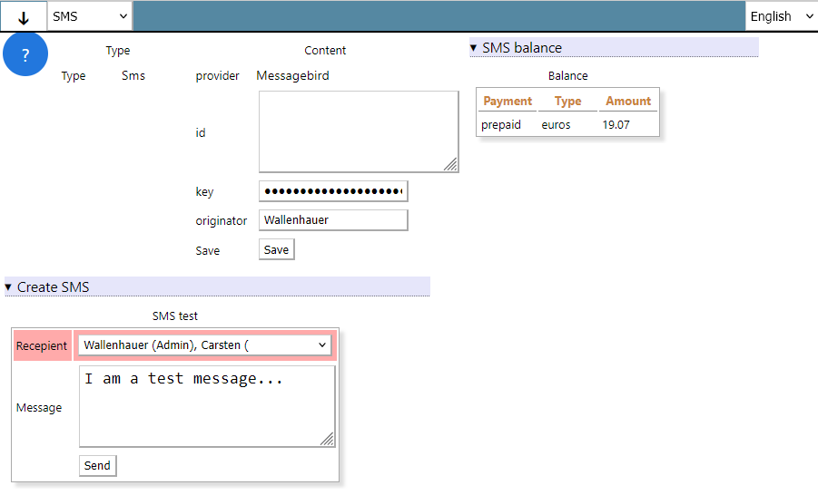
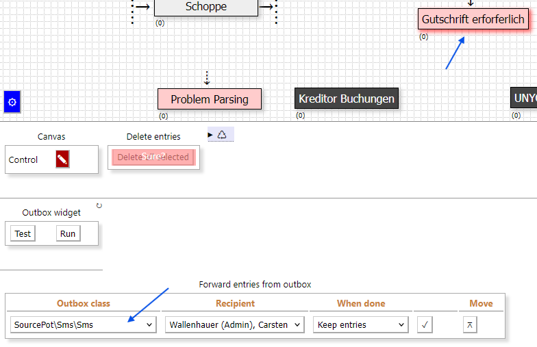

# Datapool App employing the MessageBird SMS service

The Sms.php class implements the Datapool `Transmitter` and `App` interface. The App is part of the admin category:

The transmitter implemented by the Sms.php class is available wherever data needs to be sent, see the following example:

